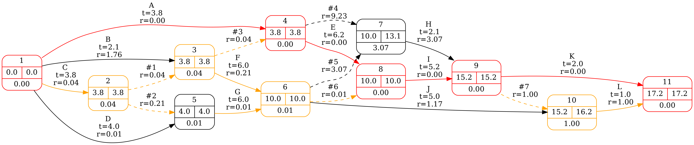

# CrazyCPM

This piece of work is dedicated to Dmitry Gerget, my scientific advisor at the [Higher School of Economics](https://www.hse.ru).

## Critical Path Method and PERT Analysis Library

[](https://www.gnu.org/licenses/gpl-3.0)


A comprehensive Python library for project management analysis using Critical Path Method (CPM) and Program Evaluation and Review Technique (PERT). CrazyCPM provides network analysis capabilities with statistical modeling and professional visualization.

## License
This project is licensed under the GNU General Public License v3.0 - see the LICENSE file for details.

## Features

### Core Analysis
 * **Activity on Arrow** — Most CPM software uses Activity-on-Node networks; CrazyCPM implements Activity-on-Arrow network modeling with automatic dummy-activity generation.
 * **Critical Path Method (CPM)** — Identify critical activities and project duration.
 * **PERT Analysis** — Statistical modeling with uncertainty quantification via a modified beta distribution.
 * **Multiple Effort Input Formats** — Support for various input methods:
   * Direct expected effort and variance
   * Three-point PERT estimates (optimistic, most likely, pessimistic)
   * Two-point PERT estimates (optimistic, pessimistic)

### Advanced Capabilities
 * **Network Optimization** — Automatic (sub)optimal dummy-activity generation.
 * **Statistical Analysis** — Propagation of mean and variance through the network.
 * **Probabilistic Estimates** — Quantile estimates and completion probabilities.
 * **Suitable for Small and Large Projects** — The modified PERT distribution gives correct estimates even for chains with few activities.

### Technical Features
 * **High Performance** — C backend for computationally intensive network analysis.
 * **Flexible Input Formats** — Multiple link dependency formats.
 * **Comprehensive Export** — Dictionary and pandas DataFrame output.
 * **Visualization** — Graphviz-based network diagrams.

## Installation

### Prerequisites
 * Python 3.9 or higher
 * C compiler (GCC, Clang, or MSVC)
 * Graphviz system installation

### Install from GitHub

```bash
# Clone the repository
git clone https://github.com/shkolnick-kun/crazy_cpm.git
cd crazy_cpm

# Install system dependencies (Ubuntu/Debian)
sudo apt-get install graphviz build-essential

# Install Python package
pip install .
```

### Dependencies

The package requires the following Python dependencies (installed automatically):
 * `numpy` (>= 1.17, < 2.0)
 * `pandas` (>= 1.0)
 * `scipy` (>= 1.13.1)
 * `graphviz` (>= 0.14.2)

## Quick Start

### Basic Usage

```python
from crazy_cpm import NetworkModel

# Define your Work Breakdown Structure (WBS)
wbs = {
    1: {'letter': 'A', 'expected': 5.0, 'exp_var': 1.0, 'name': 'Design'},
    2: {'letter': 'B', 'expected': 3.0, 'name': 'Development'},
    3: {'letter': 'C', 'optimistic': 2, 'most_likely': 3, 'pessimistic': 5, 'name': 'Testing'},
}

# Define activity dependencies (A → B → C)
links = [[1, 2], [2, 3]]

# Create and analyze the network model
model = NetworkModel(wbs, links=links)

# Get results as DataFrames
activities_df, events_df = model.to_dataframe()
print(activities_df[['letter', 'name', 'expected', 'duration', 'early_start', 'reserve']])
print(events_df[['id', 'early', 'late', 'reserve']])

# Generate visualization (format inferred from extension)
model.viz('project_network.png')
```

### Advanced PERT Analysis

```python
# Mixed effort input formats
wbs_advanced = {
    1: {'letter': 'A', 'optimistic': 3.0, 'most_likely': 5.0, 'pessimistic': 8.0},
    2: {'letter': 'B', 'optimistic': 2.0, 'pessimistic': 6.0},
    3: {'letter': 'C', 'expected': 4.0, 'exp_var': 0.5},
}

links = [[1, 2], [2, 3]]

# Create model with custom probability level (95%)
model_pert = NetworkModel(wbs_advanced, links=links, p=0.95)

# Access probabilistic estimates on activities and events
for activity in model_pert.activities:
    if activity.wbs_id == 0:
        continue  # skip dummy activities
    print(
        f"{activity.letter}: "
        f"expected={activity.expected[0]:.2f}, "
        f"duration={activity.duration[0]:.2f}, "
        f"early_start_pqe={activity.early_start_pqe:.2f}, "
        f"early_end_pqe={activity.early_end_pqe:.2f}"
    )

for event in model_pert.events:
    print(
        f"Event {event.id}: "
        f"early={event.early[0]:.2f}, "
        f"late={event.late[0]:.2f}, "
        f"early_pqe={event.early_pqe:.2f}, "
        f"late_prob={event.early_prob(event.late[0]):.3f}"
    )
```

## Resource-Aware Scheduling

The `duration` callback lets you model resource allocation, productivity, and
time-dependent availability:

```python
from crazy_cpm import NetworkModel


def resource_duration(effort, activity, base_time, target):
    """
    Convert resource effort into calendar duration.

    Parameters
    ----------
    effort : float
        Resource effort. Positive for forward pass, negative for backward pass.
    activity : _Activity
        Activity for context-aware calculations.
    base_time : float or None
        Base time during network traversal, or None for post-processing.
    target : str or None
        Scenario identifier ('early', 'late', 'optimistic', 'pessimistic', or None).

    Returns
    -------
    float
        Duration with the same sign as effort.
    """
    team_size = activity.data.get('team_size', 1)
    productivity = activity.data.get('productivity', 1.0)

    if team_size * productivity <= 0:
        return effort  # fallback: duration = effort

    abs_duration = abs(effort) / (team_size * productivity)
    return abs_duration if effort >= 0 else -abs_duration


wbs_resource = {
    1: {'letter': 'A', 'optimistic': 40.0, 'pessimistic': 60.0,
        'team_size': 2, 'productivity': 0.8, 'name': 'Design'},
    2: {'letter': 'B', 'expected': 60.0,
        'team_size': 3, 'productivity': 0.9, 'name': 'Development'},
    3: {'letter': 'C', 'expected': 20.0,
        'team_size': 1, 'productivity': 1.0, 'name': 'Testing'},
}
links_resource = [[1, 2], [2, 3]]

model_resource = NetworkModel(
    wbs_resource, links=links_resource, duration=resource_duration
)

for activity in model_resource.activities:
    if activity.wbs_id == 0:
        continue
    print(
        f"{activity.letter}: "
        f"effort={activity.expected[0]:.1f}h, "
        f"duration={activity.duration[0]:.2f}, "
        f"team={activity.data.get('team_size', 1)}"
    )
```

**Important:** the callback must preserve the sign of `effort`:

 * Forward pass (early times): `effort >= 0` → `duration >= 0`
 * Backward pass (late times): `effort <= 0` → `duration <= 0`
 * Zero effort → zero duration

## Input Formats

### Activity Effort Specifications

The WBS dictionary maps an **activity ID** to a dictionary with a required
`letter` field and one of the following effort specifications
(in order of priority)

Three-point PERT:
```python
activity_data = {
    'letter': 'X',
    'optimistic': 3.0,      # Best-case scenario
    'most_likely': 5.0,     # Most probable duration
    'pessimistic': 8.0      # Worst-case scenario
}
```

Two-point PERT:
```python
activity_data = {
    'letter': 'Y',
    'optimistic': 2.0,
    'pessimistic': 6.0      # most_likely is calculated automatically
}
```

Direct Parameters:
```python
activity_data = {
    'letter': 'Z',
    'expected': 4.5,        # Mean effort
    'exp_var': 0.25,        # Effort variance (optional, default 0.0)
}
```

Any other keys in the WBS dictionary are preserved on the activity and
exposed through `activity.data` (and therefore through `to_dict()` /
`to_dataframe()` columns).

Reserved WBS keys consumed by the parser: `expected`, `exp_var`, `letter`,
`optimistic`, `most_likely`, `pessimistic`. Do not reuse these names for
custom fields.

### Dependency Link Formats

Two-row format:
```python
links = [
    [1, 2, 3],  # Source activities
    [2, 3, 4]   # Destination activities
]
```

Two-column format:
```python
links = [
    [1, 2],     # Activity 1 → Activity 2
    [2, 3],     # Activity 2 → Activity 3
    [3, 4]      # Activity 3 → Activity 4
]
```

Dictionary format:
```python
links = {
    'src': [1, 2, 3],
    'dst': [2, 3, 4]
}
```

Legacy format (two separate arguments):

```python
model = NetworkModel(wbs, lnk_src=[1, 2, 3], lnk_dst=[2, 3, 4])
```

Do not pass `links` together with `lnk_src`/`lnk_dst` — the library will
raise `ValueError`.

## API Reference

### NetworkModel Class

The main class for network analysis:
```python
model = NetworkModel(
    wbs_dict,                    # Required: Work Breakdown Structure dictionary
    lnk_src=None,                # Legacy: source activity IDs
    lnk_dst=None,                # Legacy: destination activity IDs
    links=None,                  # Dependency links in a supported format
    duration=_default_duration,  # Resource-aware duration callback
    p=0.95,                      # Probability level for quantile estimates
    default_risk=0.3,            # Default risk factor for variance-to-bounds
    next_act_id=1,               # Starting ID for internal activity numbering
    debug=False,                 # Include computation error bounds in output
)
```

**Attributes:**

 * `model.activities` — list of `_Activity` objects
 * `model.events` — list of `_Event` objects
 * `model.is_pert` — `True` if any activity has non-zero variance
 * `model.p` — probability level used for quantile estimates
 * `model.debug` — debug flag

### Key Methods

 * `to_dataframe()` — Export results to pandas DataFrames
 * `to_dict()` — Export results to dictionary format
 * `viz(output_path=None, group_by_stage=False, get_style=_default_style)` — Generate network visualization

The `output_path` extension determines the rendering format
(`.png`, `.svg`, or `.pdf`); if omitted, PNG is used.
`group_by_stage=True` aligns events with the same topological stage.


### Output Examples

#### Activities DataFrame

Columns depend on the input, but always include:

| id | wbs_id | letter | src_id | dst_id | expected | duration | early_start | late_start | early_end | late_end | reserve |
|----|--------|--------|--------|--------|----------|----------|-------------|------------|-----------|----------|---------|
| 1  | 1      | A      | 1      | 2      | 5.0      | 5.0      | 0.0         | 0.0        | 5.0       | 5.0      | 0.0     |
| 2  | 2      | B      | 2      | 3      | 3.0      | 3.0      | 5.0         | 5.0        | 8.0       | 8.0      | 0.0     |

For PERT models, additional columns appear: `exp_var`, `variance`,
`optimistic`, `opt_start`, `opt_end`, `pessimistic`, `pes_start`,
`pes_end`, `early_start_var`, `early_end_var`, `early_start_pqe`,
`early_end_pqe`, `late_end_prob`.

Custom fields from WBS (e.g. `name`) are expanded into separate columns.

#### Events DataFrame

| id | stage | early | late | reserve |
|----|-------|-------|------|---------|
| 1  | 0     | 0.0   | 0.0  | 0.0     |
| 2  | 1     | 5.0   | 5.0  | 0.0     |
| 3  | 2     | 8.0   | 8.0  | 0.0     |

For PERT models, `optimistic`, `pessimistic`, `early_var`, `early_pqe`,
`late_prob` are added.

### Visualization

The library generates network diagrams using Graphviz:
```python
# Format is determined by the file extension
model.viz('project_network.png')  # PNG
model.viz('project_network.svg')  # SVG
model.viz('project_network.pdf')  # PDF

# If no extension is given, PNG is used
model.viz('project_network')      # → project_network.png

# group_by_stage=True aligns events with the same topological stage
model.viz('project_network.png', group_by_stage=True)
```



The visualization includes:

 * **Nodes**: events, with early/late times and reserve in the label
 * **Edges**: activities, with duration and reserve in the label
 * **Red** (`#ff0000`, penwidth=4): critical path (zero reserve)
 * **Orange** (`#ffa000`, penwidth=3): near-critical elements
 * **Black** (`#000000`, penwidth=2): non-critical elements
 * **Dashed edges**: dummy activities

Custom styling is possible via the `get_style` callback:

```python
def my_style(element):
    # element is _Event or _Activity
    return {
        'color': '#0000ff',
        'penwidth': '2',
        'fontsize': '12',
        'weight': '1',
    }

model.viz('project_network.png', get_style=my_style)
```
